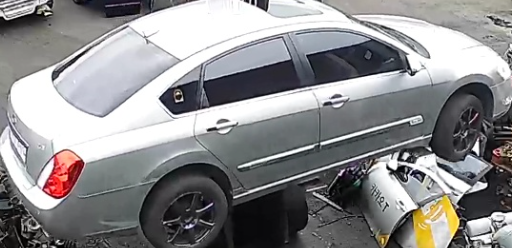

# Smart CCTV Vehicle Type Classification

지능형 CCTV 환경에서 차량을 탐지하고, 탐지된 차량 영역을 기반으로 세부 차종을 분류하는 실시간 관제용 AI 프로젝트입니다.

이 프로젝트의 목표는 단순히 `car`/`truck`을 구분하는 것이 아니라, CCTV 프레임 안의 차량을 찾아낸 뒤 실제 관제 환경에서 필요한 **차종 단위의 식별 결과**를 제공하는 것입니다.



위 이미지는 실제 폐차장 CCTV 화면에 차량 탐지 결과가 표시되는 현재 서비스 화면입니다. 현재는 차량 bounding box와 detector confidence가 보이는 단계이며, 최종적으로는 같은 bbox crop을 차종 분류기에 넣어 `차종명 + confidence`까지 함께 표시하는 것을 목표로 합니다.

## Project Summary

- **Use case**: 폐차장/주차장/출입구 CCTV 기반 차량 관제
- **Input**: CCTV 프레임 또는 저장된 이미지
- **Output**: 차량 bounding box, 차종 예측명, confidence, top-5 후보
- **Detector**: YOLO26s 기반 `car`, `truck` 객체 탐지
- **Classifier**: YOLO26s classification 기반 차종 분류기
- **Final classifier**: `models/vehicle-classifier-yolo26s-full27-2/weights/best.pt`
- **Training environment**: Google Colab T4 GPU
- **Dataset source**: AIHub CCTV 기반 차량/교통정보 관련 원천 및 라벨링 데이터

## 핵심 기능

- CCTV 또는 이미지 프레임에서 차량 객체 탐지
- 탐지된 bounding box 영역을 차량 crop으로 변환
- YOLO26s classification 모델로 차종 분류
- 예측 차종, confidence, top-5 후보를 CSV로 저장
- 실시간 카메라 관제 서비스에 붙일 수 있는 two-stage inference 구조 제공

## Pipeline

```text
CCTV frame
   |
   v
YOLO detector
car / truck bounding box detection
   |
   v
Vehicle crop
detected bbox region only
   |
   v
YOLO26s classifier
vehicle type classification
   |
   v
Prediction result
class name / confidence / top-5
```

1차 탐지는 COCO pretrained YOLO detector를 사용해 `car`, `truck` 객체만 선택합니다.  
2차 분류는 탐지된 차량 bbox 영역을 crop한 뒤, AIHub 기반 차량 이미지로 학습한 YOLO26s classification 모델이 차종을 예측합니다.

## Implementation Process

이 프로젝트는 다음 순서로 구현했습니다.

1. COCO pretrained YOLO26s detector로 CCTV 이미지에서 `car`, `truck`만 탐지
2. AIHub 라벨링 JSON의 bounding box와 차종명을 해석
3. 원천 이미지에서 차량 bbox 영역만 crop
4. crop 이미지를 YOLO classification 형식의 `train/val/test/class_name/` 폴더 구조로 정리
5. 이미지 수가 부족한 차종 클래스는 학습 제외 폴더로 분리
6. Google Colab T4 GPU에서 YOLO26s classification 모델 학습
7. 실제 폐차장 CCTV와 유사한 crop 이미지로 최종 모델 검증
8. 향후 실시간 카메라 프레임에 bbox와 차종 텍스트를 overlay하는 웹 관제 UI로 확장

## Final Model

최종 제출용 차종 분류 모델은 아래 경로에 포함되어 있습니다.

```text
models/vehicle-classifier-yolo26s-full27-2/weights/best.pt
```

보관된 모델 구성:

```text
models/vehicle-classifier-yolo26s-full27-2/
├─ weights/
│  ├─ best.pt
│  └─ last.pt
├─ args.yaml
├─ results.csv
└─ train_batch*.jpg
```

일반 추론과 제출에는 `best.pt`를 사용합니다. `last.pt`는 학습 재개 또는 백업 용도입니다.

## Dataset

학습 데이터는 AIHub의 CCTV 기반 차량/교통정보 관련 원천 데이터와 라벨링 데이터를 기반으로 구성했습니다.

라벨링 데이터의 bounding box와 차종명을 사용해 원천 이미지에서 차량 영역만 crop했고, YOLO classification 형식에 맞춰 아래 구조로 정리했습니다.

```text
vehicle_cls_crops_sampled/
├─ train/
│  ├─ class_a/
│  └─ class_b/
├─ val/
│  ├─ class_a/
│  └─ class_b/
└─ test/
   ├─ class_a/
   └─ class_b/
```

원천 데이터셋 전체는 용량과 라이선스 문제로 repository에 포함하지 않았습니다. 대신 데이터 전처리와 crop 생성 로직은 `src/`에 포함했습니다.

데이터셋 구성 과정에서 중요하게 본 기준은 다음과 같습니다.

- 라벨링 JSON에서 차량 bbox와 차종명을 추출
- 연식 정보는 클래스명에서 제거해 차종 중심으로 정리
- 같은 차종의 crop 이미지를 같은 class folder에 누적
- `train`, `val`, `test` 분할을 YOLO classification 학습 형식에 맞춤
- 클래스별 이미지 수가 너무 적은 경우 학습 안정성을 위해 제외

## Evaluation

Colab notebook에서 최종 모델 `yolo26s_cls_full-27-2`를 기준으로 학습 재개, 실제 CCTV crop 이미지 평가, 사용자 업로드 CCTV 이미지 추론을 수행했습니다.

노트북:

```text
notebooks/colab_train_predict_vehicle_cls.ipynb
```

현재 검증 방향은 다음 두 가지를 분리해 확인하는 것입니다.

- **분류 모델 자체 성능**: 이미 차량 영역만 crop된 이미지에서 차종을 잘 맞추는가
- **실서비스 파이프라인 성능**: detector가 선택한 bbox crop이 분류기에 충분히 좋은 입력인가

최근 검증에서는 실제 폐차장 CCTV에 가까운 단일 차량 crop 이미지에서는 모델이 의미 있는 예측을 보였고, 웹에서 가져온 보정된 차량 사진이나 다차량 full image에서는 오탐이 증가하는 경향을 확인했습니다. 이는 학습 데이터의 도메인과 테스트 이미지의 촬영 조건 차이가 성능에 영향을 준다는 점을 보여줍니다.

현재 repository에 포함된 `results.csv` 기준으로 기록된 validation 성능은 다음과 같습니다.

```text
top-1 accuracy: 0.90665
top-5 accuracy: 0.97743
```

다만 이 수치는 학습 split 기준의 validation 결과이므로, 실제 서비스 성능은 CCTV 촬영 각도, 차량 파손 여부, 조명, 가림, bbox 품질에 따라 달라질 수 있습니다. 따라서 노트북에서는 별도로 실제 폐차장 CCTV 이미지에 가까운 샘플을 넣어 모델이 현장 이미지에서도 차종을 맞추는지 확인했습니다.

Drive Colab notebook의 마지막 추론 셀 출력 결과입니다. 수동 업로드한 CCTV 계열 테스트 이미지 10장에 대해 `full27-2` 모델이 반환한 **테스트이미지-예측값 10쌍**과 confidence를 README에도 그대로 요약했습니다. 이 셀은 정답 라벨을 따로 입력하지 않은 상태라 `unchecked`로 기록되어 있으며, 아래 표는 모델이 실제로 반환한 top-1 예측입니다.

| Test image | Predicted vehicle type | Confidence |
| --- | --- | ---: |
| User attachment.png | `rodius_rodius` | 0.6081 |
| User attachment1.png | `grandeur_tg` | 0.9661 |
| User attachment2.png | `carnival_r` | 0.5298 |
| User attachment3.png | `korando_turismo` | 0.9054 |
| User attachment4.png | `sm5_new` | 0.9882 |
| User attachment5.png | `sonata_yf` | 1.0000 |
| User attachment6.png | `k5_2th` | 0.9632 |
| User attachment7.png | `sm5_new` | 0.9965 |
| 스크린샷 2026-07-23 135105.png | `cruze_cruze` | 0.6656 |
| 스크린샷 2026-07-23 135358.png | `spark_spark` | 0.9999 |

이 결과는 웹에서 가져온 보정 차량 이미지보다 실제 CCTV/폐차장 계열 이미지에서 모델 출력이 더 안정적으로 나오는지를 확인하기 위한 진단용 결과입니다. 특히 confidence가 높은 샘플은 현재 학습 데이터의 촬영 도메인과 테스트 이미지 도메인이 가까울 때 분류기가 꽤 강하게 반응한다는 근거로 볼 수 있습니다.

## Demo Direction

최종 서비스 화면은 아래와 같은 형태를 목표로 합니다.

```text
Live CCTV frame
  -> detected vehicle bbox
  -> vehicle type text overlay
  -> frame image saved
  -> web page list/detail view
```

현재는 차량 bbox 탐지 결과를 화면에 표시하는 단계이며, 이후 동일 bbox crop을 차종 분류기에 입력해 다음과 같은 형태로 확장할 예정입니다.

```text
[bbox] Carnival R 0.91
[bbox] Korando Turismo 0.84
```

즉, 카메라 화면 위에 차량 위치와 차종명을 함께 표시하고, 프레임별 결과 이미지를 저장해 웹 페이지에서 목록 조회와 상세 확인이 가능하도록 만드는 것이 최종 목표입니다.

## Why This Matters

일반적인 차량 탐지는 `car`, `truck` 수준의 객체 인식에 머무르는 경우가 많습니다. 하지만 관제 서비스에서는 “차량이 있다”보다 “어떤 차종인가”가 더 유용한 정보가 될 수 있습니다.

이 프로젝트는 다음 상황을 목표로 합니다.

- 폐차장, 주차장, 출입구 CCTV 기반 차량 모니터링
- 특정 차종 출현 이력 저장
- 프레임별 탐지 결과와 차종 예측 로그 생성
- 향후 웹 UI에서 탐지 이미지 목록과 상세 프레임 조회

## Repository Structure

```text
configs/
  pipeline.yaml

models/
  vehicle-classifier-yolo26s-full27-2/

notebooks/
  colab_train_predict_vehicle_cls.ipynb

src/
  append_aihub_zip_to_cls_dataset.py
  crop_aihub_to_cls_dataset.py
  crop_aihub_zip_to_cls_dataset.py
  infer_two_stage.py
  predict_cls.py
  prepare_cls_dataset.py
  train.py

requirements.txt
```

## Quick Start

```bash
pip install -r requirements.txt
```

Two-stage inference:

```bash
python src/infer_two_stage.py \
  --det-weights yolo26s.pt \
  --cls-weights models/vehicle-classifier-yolo26s-full27-2/weights/best.pt \
  --source samples \
  --out runs/two_stage
```

Crop image classification:

```bash
python src/predict_cls.py \
  --weights models/vehicle-classifier-yolo26s-full27-2/weights/best.pt \
  --source samples/vehicle_crops \
  --out runs/vehicle_cls_predict \
  --imgsz 224 \
  --topk 5
```

## Limitations and Next Steps

- 비슷한 외관의 연식/파생 차종은 confusion이 발생할 수 있습니다.
- 학습 데이터와 다른 도메인, 예를 들어 홍보용 차량 사진이나 강한 보정/반사광이 있는 이미지는 성능이 낮아질 수 있습니다.
- 실제 서비스에서는 한 프레임에 차량이 여러 대일 때 관심 차량 선택 로직이 필요합니다.
- 향후에는 실시간 IP camera 입력, 결과 이미지 저장, 웹 기반 프레임 조회 UI를 통합할 예정입니다.

## Tech Stack

- Python
- Ultralytics YOLO
- OpenCV
- PyTorch
- Google Colab T4 GPU
- Google Drive based experiment storage
